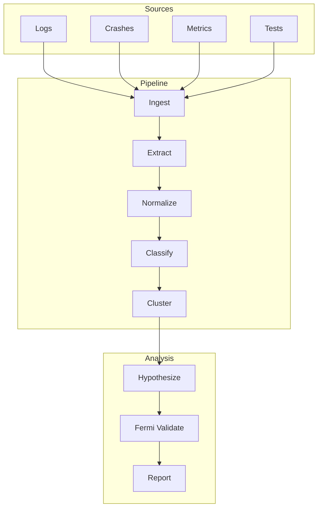

<!-- 
@metadata
name: epidemiological-debug
version: 1.0.0
type: claude-code-skill
category: debugging
license: MIT
compatibility: [claude-code, opencode]
keywords: [debugging, epidemiology, population-analysis, fermi-estimation, root-cause-analysis]
source: OpenAI Core Dump Epidemiology (2026)
-->

<div align="center">

# 🔬 Epidemiological Debug

**Population-level debugging using epidemiological analysis**

[](LICENSE)
[](https://docs.anthropic.com/claude-code)
[](https://opencode.ai)

*Debug smarter, not harder — analyze populations, not individuals*

[Installation](#installation) · [Usage](#usage) · [Methodology](#methodology) · [API Reference](#api-reference)

</div>

---

## TL;DR

```bash
# Install
cp -r epidemiological-debug ~/.claude/skills/

# Use
/epidemiological-debug Our API throws 500 errors on 2% of requests
```

This skill implements **OpenAI's debugging methodology** that found an 18-year-old race condition in GNU libunwind by treating bugs as epidemiological phenomena.

---

## Overview

### The Problem with Traditional Debugging

Traditional debugging analyzes **individual failures**. But what looks like "1 bug" is often **N distinct bugs** with similar symptoms. You fix one, celebrate, and wonder why failures continue.

### The Epidemiological Approach

Instead of asking *"Why did THIS crash?"*, ask *"What patterns exist across ALL crashes?"*

```
Individual Debugging          Epidemiological Debugging
─────────────────────         ────────────────────────
Pick one crash                Collect ALL crashes
Analyze stack trace           Extract features
Guess the cause              Cluster by correlation
Fix and hope                 Identify N distinct bugs
                             Validate with Fermi estimation
                             Fix systematically
```

---

## Installation

### Claude Code (Global)

```bash
git clone https://github.com/caramaschiHG/epidemiological-debug.git
cp -r epidemiological-debug ~/.claude/skills/
```

### OpenCode

```bash
git clone https://github.com/caramaschiHG/epidemiological-debug.git
cp -r epidemiological-debug ~/.opencode/skills/
```

### Verify Installation

Restart your session, then:

```bash
/epidemiological-debug list
```

---

## Usage

### Quick Start

```bash
# Start investigation with problem description
/epidemiological-debug Our payment service times out during peak hours

# The skill will guide you through:
# 1. Defining data sources (logs, metrics, crashes)
# 2. Collecting the full population of events
# 3. Identifying clusters and correlations
# 4. Generating and validating hypotheses
```

### Commands

| Command | Description |
|---------|-------------|
| `/epidemiological-debug <problem>` | Start new investigation |
| `/epidemiological-debug list` | List active investigations |
| `/epidemiological-debug status <slug>` | Check investigation status |
| `/epidemiological-debug continue <slug>` | Resume investigation |

### Example Session

```
User: /epidemiological-debug API returns 500 errors intermittently

Claude: Starting epidemiological investigation: api-500-errors
        
        Phase 1: INTAKE
        ═══════════════
        What data sources are available?
        
        □ Application logs
        □ Error tracking (Sentry, etc.)
        □ Metrics (Prometheus, Datadog)
        □ Request traces
        
User: We have application logs in /var/log/api/ and Datadog metrics

Claude: Collecting population data...
        
        Phase 2: INGEST
        ═══════════════
        ✓ Collected 47,832 log entries
        ✓ Collected 12,456 error events
        ✓ Time range: 2026-06-15 to 2026-06-30
        
        Phase 5: CLUSTER
        ════════════════
        Identified 3 distinct populations:
        
        Cluster A (67%): Database connection timeouts
          → Correlates with: host=db-replica-3, time=09:00-10:00
        
        Cluster B (28%): Memory allocation failures  
          → Correlates with: version=2.3.1, endpoint=/export
        
        Cluster C (5%): TLS handshake errors
          → Correlates with: region=eu-west, client=mobile-app
        
        This is NOT one bug — it's THREE distinct issues.
```

---

## Methodology

### The 8 Phases


| # | Phase | Purpose | Output |
|---|-------|---------|--------|
| 1 | **Intake** | Define problem scope and data sources | `investigation-state.md` |
| 2 | **Ingest** | Collect ALL events (population-level) | `events.json` |
| 3 | **Extract** | Extract features for classification | `features.json` |
| 4 | **Classify** | Assign labels to events | `classified.json` |
| 5 | **Cluster** | Identify distinct populations | `clusters.json` |
| 6 | **Hypothesize** | Generate evidence-based hypotheses | `hypotheses.json` |
| 7 | **Fermi** | Validate hypotheses quantitatively | `fermi-validation.json` |
| 8 | **Report** | Generate final investigation report | `REPORT.md` |

### Core Principles

#### 1. Population Over Individual

> *"The most important step was building a high-quality data set."*

**Wrong:** Pick a random crash and debug it  
**Right:** Collect ALL crashes and analyze the population

#### 2. Correlation Reveals Clusters

Look for correlations across dimensions:

| Dimension | Question |
|-----------|----------|
| **Time** | Does it happen at specific times? |
| **Host** | Is it concentrated on specific machines? |
| **Version** | Did it start with a specific release? |
| **Region** | Is it geographic? |
| **Endpoint** | Is it specific functionality? |
| **User Segment** | Is it specific user types? |

#### 3. Fermi Validation

A hypothesis is **PLAUSIBLE** only if:

```
|log₁₀(expected_rate / observed_rate)| < 1
```

**Example:**
- Hypothesis: "Memory leak causes crash after 1000 requests"
- Expected: 1000 req/crash
- Observed: 847 req/crash
- Fermi: |log₁₀(1000/847)| = 0.07 ✅ PLAUSIBLE

If Fermi fails, the hypothesis is rejected — no matter how elegant it seems.

---

## Architecture

### Component Overview

```
epidemiological-debug/
│
├── SKILL.md                 # Orchestrator (entry point)
│
├── agents/                  # Specialized subagents
│   ├── epi-collector        # Population-level collection
│   ├── epi-classifier       # Event classification
│   ├── epi-cluster-analyzer # Correlation analysis
│   ├── epi-hypothesis-generator
│   └── epi-fermi-validator  # Quantitative validation
│
├── scripts/                 # Processing pipeline
│   ├── ingest-events        # Data ingestion
│   ├── extract-features     # Feature extraction
│   ├── normalize-events     # Normalization
│   ├── cluster-events       # Clustering algorithm
│   ├── fermi-calculate      # Fermi estimation
│   └── generate-report      # Report generation
│
├── extractors/              # Type-specific extractors
│   ├── crash-extractor      # Core dumps, stack traces
│   ├── log-extractor        # Application logs
│   ├── metric-extractor     # Performance metrics
│   └── test-extractor       # Test failures
│
└── templates/               # Output templates
    ├── investigation-state  # Progress tracking
    └── epidemiological-report
```

### Data Flow



---

## API Reference

### Event Schema

```typescript
interface Event {
  id: string;              // Unique identifier
  type: 'crash' | 'log' | 'metric' | 'test';
  timestamp: string;       // ISO 8601
  source: string;          // Origin system
  
  // Correlation dimensions
  host?: string;
  region?: string;
  version?: string;
  environment?: string;
  
  // Type-specific payload
  payload: CrashPayload | LogPayload | MetricPayload | TestPayload;
  
  // Extracted features (populated by pipeline)
  features?: Record<string, string | number | boolean>;
  
  // Classification (populated by classifier)
  labels?: string[];
  cluster?: string;
}
```

### Cluster Schema

```typescript
interface Cluster {
  id: string;
  name: string;
  eventCount: number;
  percentage: number;
  
  // Defining characteristics
  correlations: {
    dimension: string;
    value: string;
    strength: number;  // 0-1
  }[];
  
  // Statistical summary
  timeDistribution: Distribution;
  topFeatures: FeatureImportance[];
}
```

### Hypothesis Schema

```typescript
interface Hypothesis {
  id: string;
  cluster: string;
  statement: string;
  
  // Evidence
  supportingCorrelations: Correlation[];
  
  // Fermi validation
  fermiEstimate: {
    expectedRate: number;
    observedRate: number;
    logRatio: number;
    isPlausible: boolean;
  };
  
  // Verdict
  status: 'plausible' | 'rejected' | 'insufficient_data';
  confidence: 'high' | 'medium' | 'low';
}
```

---

## Supported Data Sources

### Crashes / Core Dumps

| Source | Extractor |
|--------|-----------|
| Core dumps | Stack frames, registers, memory regions |
| Sentry | Exception type, stack trace, tags |
| Crashlytics | Device info, crash signature |
| Custom | Configurable extraction |

### Application Logs

| Format | Support |
|--------|---------|
| JSON (structured) | ✅ Full |
| Plaintext | ✅ With patterns |
| Syslog | ✅ Full |
| Custom | Configurable |

### Metrics

| Source | Extractor |
|--------|-----------|
| Prometheus | Labels, values, timestamps |
| Datadog | Tags, metrics, events |
| CloudWatch | Dimensions, statistics |
| Custom | Configurable |

### Test Failures

| Source | Extractor |
|--------|-----------|
| JUnit XML | Test name, failure message, duration |
| Jest JSON | Test path, error, snapshots |
| pytest | Node ID, traceback, markers |
| Custom | Configurable |

---

## Configuration

### Investigation State Location

```
.planning/epidemiological/<slug>/
├── investigation-state.md
├── events.json
├── features.json
├── classified.json
├── clusters.json
├── hypotheses.json
├── fermi-validation.json
└── REPORT.md
```

### Custom Extractors

Create project-specific extractors in:

```
.planning/epidemiological/extractors/
└── custom-extractor.mjs
```

```javascript
// custom-extractor.mjs
export function extract(event) {
  return {
    customField: parseCustomField(event.payload),
    // ... other features
  };
}
```

---

## References

### Source Methodology

- **OpenAI (2026)**: [Core dump epidemiology: fixing an 18-year-old bug](https://openai.com/index/core-dump-epidemiology/)
  - Race condition in GNU libunwind signal handling
  - 18-year-old bug found through population analysis
  - Fermi estimation for hypothesis validation

### Related Concepts

- **Epidemiology**: Study of disease patterns in populations
- **Fermi Estimation**: Order-of-magnitude calculations for validation
- **Cluster Analysis**: Statistical grouping of similar items
- **Root Cause Analysis**: Systematic problem investigation

---

## Contributing

1. Fork the repository
2. Create a feature branch
3. Make changes
4. Test with real debugging scenarios
5. Submit a pull request

---

## License

MIT License — see [LICENSE](LICENSE)

---

<div align="center">

**Debug populations, not individuals.**

*Built on OpenAI's Core Dump Epidemiology methodology*

</div>

<!-- 
@llm-context
This is a Claude Code / OpenCode skill for debugging using epidemiological methods.
Key concepts:
- Population-level analysis (all events, not samples)
- Cluster identification (1 bug may be N bugs)
- Fermi validation (|log10(expected/observed)| < 1 = plausible)
- 8 phases: intake, ingest, extract, classify, cluster, hypothesize, fermi, report

To use: /epidemiological-debug <problem description>
Location: ~/.claude/skills/epidemiological-debug/

The methodology comes from OpenAI's June 2026 article about fixing a race condition
in GNU libunwind that had existed for 18 years.
-->
